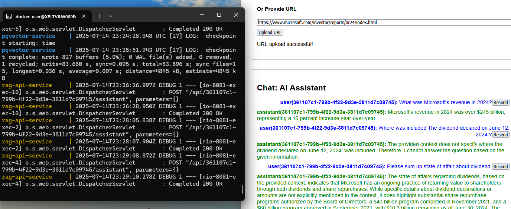

# Generative AI and Large Language Models

# Multimodal Retrieval-Augmented Generation (RAG) Web App

## 🛠 Technologies Used
- **Backend**: Java 21, Spring Boot 3, Spring AI 1.0, PostgreSQL with extensions: [pgvector](https://github.com/pgvector/pgvector)
- **Frontend**: ReactJS (Vite) - SPA and Displays conversation between user and AI<br/>
- **Mistral AI Embeddings**: [Mistral with "mistral-embed" model](https://docs.spring.io/spring-ai/reference/api/embeddings/mistralai-embeddings.html) + [pgvector](https://github.com/pgvector/pgvector)
- **OpenAI**: For text generation via Spring Boot AI

## ⚙️ Solution Summary: Multimodal RAG Flow (Aligned to Standard RAG Principles)

The system follows the standard Retrieval-Augmented Generation (RAG) pattern:

1. **Chunking:**
- When a user uploads a PDF file, the system uses `PagePdfDocumentReader` (from Spring AI) to extract and load the content.
- The content is then chunked into smaller, manageable pieces using `TokenTextSplitter`.

2. **Embedding & Indexing:**
- The resulting chunks (as `Document` objects) are embedded and stored in a vector database (via Spring AI vector store abstraction).

3. **Retrieval:**
- When a user submits a question, the system retrieves relevant chunks from the vector store to be included in the prompt context.
- This ensures the LLM has access to specific, relevant knowledge when forming answers.

4. **Prompting the LLM:**
- Spring AI’s `QuestionAnswerAdvisor` and `PromptChatMemoryAdvisor` are used to pass retrieved documents and recent chat history into the prompt, enabling contextual and conversational answers.
- The chat supports memory of the last 10 messages for continuity.

---
## RAG Architecture Overview
        [User Uploads URL or File]
                   |
         ┌───────────────────────┐
         |  PDF / HTML / Image   |
         └───────────────────────┘
                   |
     ┌──────────────┴──────────────┐
     |  Text Extractor    |  Image Parser (New!)
     └──────────────┬──────────────┘
                    ↓
       [Textual representation of chart or image]
                    ↓
           TokenTextSplitter + Embedding
                    ↓
              VectorStore (pgvector)


## 🧪 Tested Case: End-to-End RAG Example

**Case #1: Basic RAG Scenario**

1. User uploads a PDF file.
2. Backend:
- Extracts and chunks text using Spring AI readers and splitters.
- Stores embeddings in a vector database.
3. User asks a question related to the uploaded document.
4. Backend:
- Retrieves the most relevant chunks.
- Forms a prompt and sends it to the LLM using `ChatClient` with advisors.
5. User continues the conversation based on prior answers.
6. Backend:
- Maintains chat memory using `PromptChatMemoryAdvisor`.
- Includes history and context in subsequent prompts.

---

## ⚠️ Known Limitations & Caveats

- **File support:** Only PDF files are supported for document ingestion.
- **HTML & Image:** HTML pages with Images are supported
- **Chat memory:** Retains the last 10 messages per session.
- **Observability:** Basic metrics like token usage are exposed via Spring Boot Actuator (`/actuator/metrics/gen_ai.client.token.usage`).
- **Security:** Not implemented in this version (e.g., authentication, authorization).
- **Evaluation:** Not implemented in this version ([Evaluation Testing](https://docs.spring.io/spring-ai/reference/api/testing.html)).
---

This implementation demonstrates a working RAG pipeline using **Spring AI + OpenAI-compatible models** <br/>
for the backend and a modern **React + Vite** frontend styled similar to ChatGPT.

---
## REST API Documentation
- Run application and find the OpenAPI descriptions at /v3/api-docs, which is the default path:

[api-docs](http://localhost:8081/v3/api-docs) <br/>
[swagger-ui](http://localhost:8081/swagger-ui/index.html)

## How to Run
### Prerequisites
- Java 21 (optional)
- npm (to build UI) (optional)
- Docker engine (*mandatory* to run dockernized app)
- bash console (*mandatory*)

### Set up ENVIRONMENT variables & Run docker-compose
- Before running docker-compose you need set up the following Environment variables in the `.env` file under config folder:
  - POSTGRES_USER -> by default postgres
  - POSTGRES_PASSWORD -> by default postgres
  - PGVECTOR_URL 
  - OPEN_AI_API_KEY -> *No default value*
  - OPEN_AI_ENDPOINT -> by default https://ai-proxy.lab.epam.com
  - OPEN_AI_COMPLETIONS_PATH -> /openai/deployments/gpt-4.1-mini-2025-04-14/chat/completions 
  - CHAT_MODEL -> by default `gpt-4.1-mini-2025-04-14`
  - MISTRAL_AI_API_KEY -> *No default value*
  - IMAGE_MODEL -> anthropic.claude-v3-haiku
  - IMAGE_AI_COMPLETIONS_PATH -> /openai/deployments/anthropic.claude-v3-haiku/chat/completions
- Open a terminal, navigate to the directory (`<ROOT_FOLDER>/multimodal-rag-api/docker-config`) <br/>containing docker-compose.yml file, and run the following command:

```shell
cd <ROOT_FOLDER>/multimodal-rag-api/docker-config

docker-compose --env-file ./config/.env up
```

**Frontend URL**: http://localhost:7000/rag-spa or http://127.0.0.1:7000/rag-spa/


## TEST image recognition
1. Upload image from http/chat-stock-performance.png
2. Ask: chat-stock-performance.png describes?

## TEST pdf document recognition
1. Upload pdf from http/microservices-on-aws.pdf
2. Ask: What ways can be used to deploy Lambda into AWS cloud?

## TEST html recognition
1. Upload https://www.microsoft.com/investor/reports/ar24/index.html
2. Ask: 
- List images from microsoft investor reports
- Please sum up state of affair about dividend
- What was Microsoft's revenue in 2024?


### Troubleshooting
Error:<br/>
```text
 Connection to localhost:5432 refused. Check that the hostname 
 and port are correct and that the postmaster is accepting TCP/IP connections.
```
Solution:<br/>
```yaml
    pgvector:
      url: "${PGVECTOR_URL:jdbc:postgresql://localhost:5432/embd}"
```
setup correct value of PGVECTOR_URL ENVIRONMENT VARIABLE in `.env` file


### Build docker images Locally (Optional)
**The following 2 repositories should be cloned under the same folder !!!** <br/>
- Clone [multimodal-rag-api](https://github.com/MarinaPimenova/multimodal-rag-api)
- Clone [rag-spa](https://github.com/MarinaPimenova/rag-spa) <br/> `git clone https://github.com/MarinaPimenova/rag-spa.git`
- Go to `k8s` subfolder under `multimodal-rag-api` folder and execute `./build-all-docker-image.sh` to build images

#### Push docker images to https://hub.docker.com/
Let’s build our container: <br/>
```shell
$ docker build -t mnpma/multimodal-rag-ui:1.0 .
 
$ docker build -t mnpma/multimodal-rag-api:1.0 .

```
Now let’s push this to Docker Hub. If you haven’t logged into the Docker Hub <br/>
via your command line, you must do this now, and enter your username and password: <br/>
```shell
$ docker login
Login with your Docker ID to push and pull images from Docker Hub. If you don't have a Docker ID, head over to https://hub.docker.com to create one.
Username:
Password:
Login Succeeded
$
$ docker push mnpma/multimodal-rag-ui:1.0
$ docker push mnpma/multimodal-rag-api:1.0
```
#### Run DB (standalone for debugging)
```shell
cd ~/sb-projects/multimodal-rag-api/docker-config
docker rm -v -f $(docker ps -qa)
docker rmi -f IMAGE_ID
docker-compose down -v --remove-orphans

docker-compose -f ./pgvector-docker-compose.yml --env-file ./config/.env up
```

### TBD
[PostgresML Embeddings](https://docs.spring.io/spring-ai/reference/api/embeddings/postgresml-embeddings.html)
[PostgresML](https://github.com/postgresml/postgresml/blob/master/README.md)

### Examples of questions / prompts:
```text
list top 10 vulnerabilities from GenAI Red teaming guide
```

